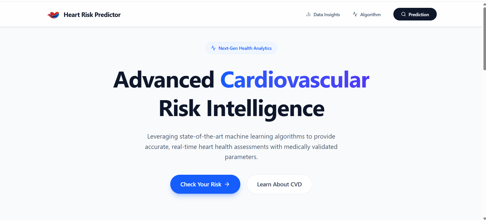
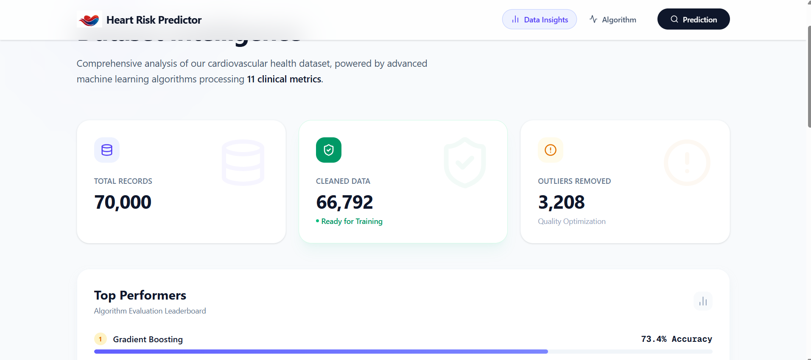
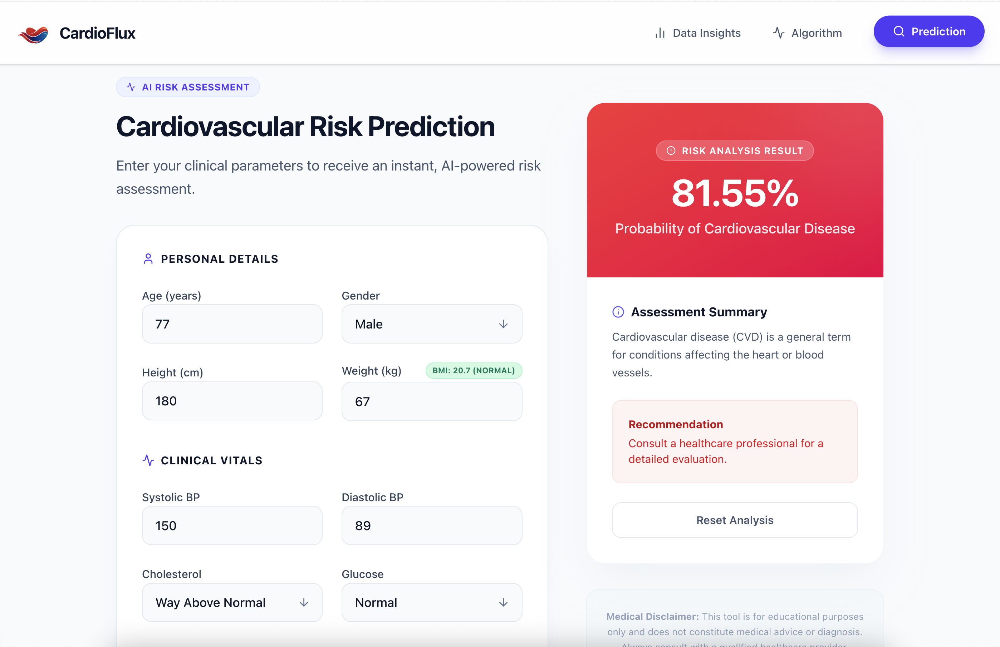

# 🫀 Heart Risk Predictor: Cardiovascular Disease Risk Prediction



Heart Risk Predictor is a sophisticated machine learning platform designed to predict cardiovascular disease risk with high precision. By leveraging a Gradient Boosting model and clinical data analysis, Heart Risk Predictor provides users with actionable insights into their heart health.

---

## 🚀 Key Features

- **Precise Risk Prediction**: Utilizes an optimized Gradient Boosting classifier (80.1% ROC AUC) to assess CVD risk based on 11 clinical metrics.
- **Interactive Data Insights**: Visualizes dataset statistics, model performance metrics, and feature analysis.
- **Real-time BMI Calculation**: Seamlessly integrated BMI assessment within the prediction flow.
- **Clean SaaS UI**: Modern, premium interface built with Next.js and Tailwind CSS for an intuitive user experience.

---

## 📸 Screenshots

### 📊 Data Insights & Model Performance
Detailed analysis of the trained models, including Accuracy, F1-Score, and Performance comparison.


### 🩺 Risk Assessment UI
User-friendly interface for inputting clinical data and receiving instant risk evaluations.


---

## 🛠️ Tech Stack

### Frontend
- **Framework**: Next.js 16 (React 19)
- **Styling**: Tailwind CSS 4
- **Icons**: Lucide React
- **UI Components**: Custom premium SaaS components

### Backend & ML
- **API Framework**: FastAPI (Python)
- **Machine Learning**: Scikit-learn (Gradient Boosting Classifier)
- **Data Processing**: Pandas, NumPy
- **Serialization**: Pickle

---

## 📂 Project Structure

```text
.
├── backend/               # FastAPI Server & ML Model
├── frontend/              # Next.js Application
├── data/                  # Dataset (Raw & Processed)
├── Pre-Processing.ipynb   # Data Cleaning & Feature Engineering
├── train_all_models.ipynb # Model Training & Evaluation
└── verify_model.py        # Model Verification Script
```

---

## ⚙️ Development Setup

### Backend
1. Navigate to the backend directory:
   ```bash
   cd backend
   ```
2. Create and activate a virtual environment:
   ```bash
   python -m venv .venv
   source .venv/bin/activate  # On Windows: .venv\Scripts\activate
   ```
3. Install dependencies:
   ```bash
   pip install -r requirements.txt
   ```
4. Run the server:
   ```bash
   python main.py
   ```

### Frontend
1. Navigate to the frontend directory:
   ```bash
   cd frontend
   ```
2. Install dependencies:
   ```bash
   npm install
   ```
3. Run the development server:
   ```bash
   npm run dev
   ```

---

## 📊 Model Details
- **Primary Model**: Gradient Boosting Classifier
- **Accuracy**: 73.4%
- **F1-Score**: 0.733
- **ROC AUC**: 0.801
- **Features Analyzed**: Age, Gender, Height, Weight, Blood Pressure (Systolic/Diastolic), Cholesterol, Glucose, Smoking, Alcohol, Physical Activity.

---

*Lincensed under MIT.*
